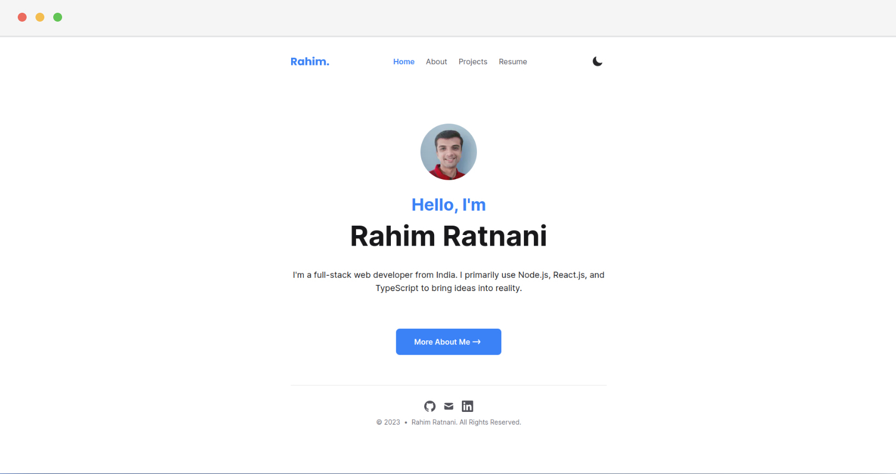

# rahimratnani.com



**:point_right: See it live [here](https://rahimratnani.com)**

## Run It Locally

```bash
# Clone this repository
$ git clone git@github.com:rahimratnani/rahimratnani.com.git

# Go into the repository
$ cd rahimratnani.com

# Install dependencies
$ npm install

# Start development server
$ npm dev
```

## Technologies Used

- [Nextjs](https://nextjs.org/)
- [TypeScript](https://www.typescriptlang.org/)
- [Tailwind CSS](https://tailwindcss.com/)
- [Vercel](https://vercel.com/)

## License

The code is released under the **MIT license**. Feel free to edit and distribute it after removing all of my personal information.

Please review the [LICENSE](https://github.com/rahimratnani/rahimratnani.com/blob/main/LICENSE) for more information.
